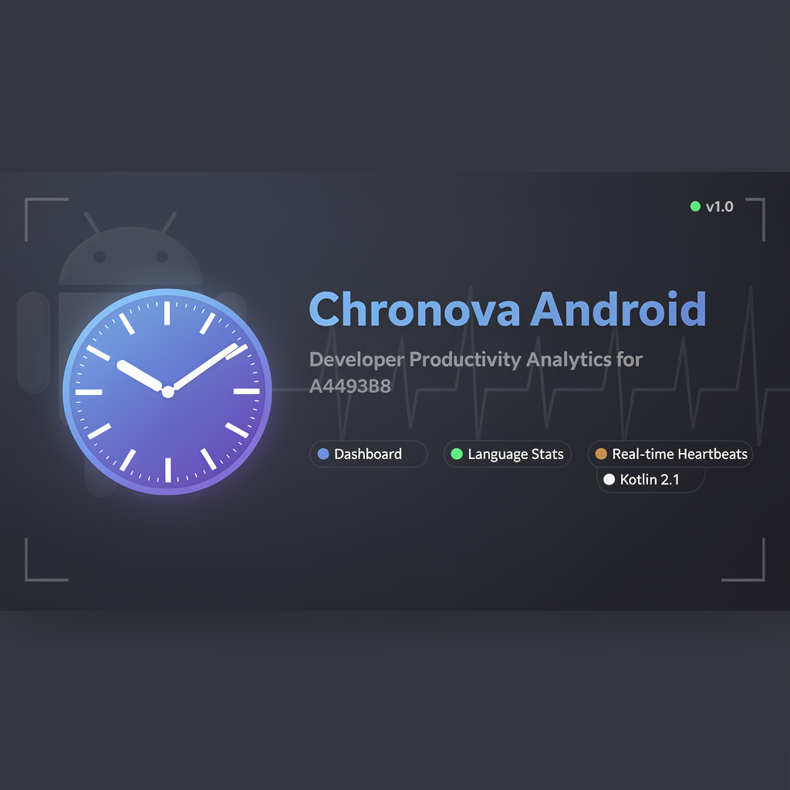

<p align="center">
  
</p>

# Chronova Android

[](https://developer.android.com)
[](https://kotlinlang.org)
[](LICENSE)

An Android application for developer productivity analytics. Connects to a Chronova server to display coding statistics including language usage, project time, editor activity, and real-time heartbeats.

## Features

- **Dashboard Overview** - Summary cards with pie charts and activity graphs
- **Language Statistics** - Track time spent in different programming languages
- **Project Analytics** - View coding time per project
- **Editor Usage** - Monitor which editors/IDEs you use most
- **File Activity** - Recent file activity tracking
- **Multiple Time Ranges** - View stats for Today, 7 Days, or 30 Days
- **Offline Support** - Caches authentication and server settings

## Screenshots

*Screenshots will be added here*

## Architecture

```
┌─────────────────────────────────────┐
│           UI Layer                  │
│  Activities, Fragments, Adapters    │
└──────────────┬──────────────────────┘
               │
┌──────────────▼──────────────────────┐
│         Repository Layer            │
│     ChronovaRepository (SSOT)       │
│  - SharedPreferences management     │
│  - API calls                        │
│  - Data transformation              │
└──────────────┬──────────────────────┘
               │
┌──────────────▼──────────────────────┐
│           Data Layer                │
│  Retrofit + ChronovaApiService      │
│  ApiModels (DTOs)                   │
└─────────────────────────────────────┘
```

- **Custom MVVM** without Architecture Components ViewModels
- **Repository Pattern** for data management
- **Manual Dependency Injection** (no DI framework)
- **Coroutines** with `lifecycleScope` for async operations
- **ViewBinding** for type-safe view access

## Tech Stack

- **Language**: Kotlin 2.1.20 (JVM 17)
- **Min SDK**: 24 (Android 7.0)
- **Target SDK**: 36 (Android 16)
- **Build Tool**: Gradle 8.13.2

### Dependencies

| Category | Libraries |
|----------|-----------|
| **Android Core** | AppCompat 1.7.1, Material 1.13.0, ConstraintLayout 2.2.1 |
| **Navigation** | Navigation KTX 2.9.6 |
| **Lifecycle** | ViewModel 2.10.0, LiveData 2.9.4 |
| **Networking** | Retrofit 3.0.0, Gson Converter, OkHttp Logging 5.3.2 |
| **Charts** | MPAndroidChart 3.1.0 |
| **UI** | RecyclerView 1.4.0, ViewPager2 1.1.0 |
| **Storage** | Preference KTX 1.2.1 |

## Getting Started

### Prerequisites

- Android Studio Ladybug (2024.2.1) or newer
- JDK 17 or higher
- Android SDK with API 36

### Installation

1. Clone the repository:
```bash
git clone <repository-url>
cd chronova-android
```

2. Open in Android Studio or build via command line:
```bash
./gradlew assembleDebug
```

3. Install the APK:
```bash
adb install app/build/outputs/apk/debug/app-debug.apk
```

### Docker Build

For CI/CD or containerized builds:
```bash
./docker-build.sh
```

## Usage

1. **First Launch**: Enter your Chronova server URL and API key
2. **Login**: Authenticate with your Chronova credentials
3. **Dashboard**: View summary statistics and charts
4. **Navigation**: Use bottom navigation to switch between views:
   - Dashboard - Overview with charts
   - Languages - Programming language breakdown
   - Projects - Time per project
   - Editors - IDE/editor usage
   - Files - Recent file activity

### Server Configuration

Default server: `https://chronova.dev/`

You can configure a custom Chronova server in Settings.

## Project Structure

```
app/src/main/java/com/chronova/app/
├── data/
│   ├── ApiClient.kt              # Retrofit singleton
│   ├── ApiModels.kt              # Data classes
│   ├── ChronovaApiService.kt     # API interface
│   └── ChronovaRepository.kt     # Repository (SSOT)
├── ui/
│   ├── main/
│   │   ├── cards/                # Dashboard card components
│   │   │   ├── CardsAdapter.kt
│   │   │   ├── CardsList.kt
│   │   │   └── viewholders/
│   │   ├── MainStatsFragment.kt
│   │   └── MainPagerFragment.kt
│   ├── DashboardFragment.kt
│   ├── ProjectsFragment.kt
│   ├── LanguagesFragment.kt
│   ├── EditorsFragment.kt
│   ├── FilesFragment.kt
│   └── [Various Adapters]
├── LoginActivity.kt
└── MainActivity.kt
```

## API Integration

The app communicates with a Chronova server using REST APIs:

```kotlin
interface ChronovaApiService {
    @POST("api/auth/login")
    suspend fun login(@Body request: LoginRequest): LoginResponse
    
    @GET("api/dashboard")
    suspend fun getDashboard(@Header("Authorization") apiKey: String): DashboardResponse
    
    @GET("api/stats")
    suspend fun getStats(@Query("range") range: String): StatsResponse
    
    // ... additional endpoints
}
```

All API calls return `Result<T>` for type-safe error handling.

## Building

### Debug Build
```bash
./gradlew assembleDebug
```
Output: `app/build/outputs/apk/debug/app-debug.apk`

### Release Build
```bash
./gradlew assembleRelease
```
Output: `app/build/outputs/apk/release/app-release.apk`

The release build uses a pre-configured keystore for signing.

## Testing

**Note**: No tests are currently implemented. The project includes test dependencies:
- JUnit 4.13.2
- Espresso 3.7.0

To add tests, place them in:
- `src/test/` - Unit tests
- `src/androidTest/` - Instrumented tests

## Contributing

1. Fork the repository
2. Create a feature branch (`git checkout -b feature/amazing-feature`)
3. Commit your changes (`git commit -m 'Add amazing feature'`)
4. Push to the branch (`git push origin feature/amazing-feature`)
5. Open a Pull Request

### Development Guidelines

- Follow existing code style and patterns
- Use ViewBinding for all view references
- Return `Result<T>` from Repository methods
- Use `lifecycleScope` for coroutines in Fragments
- Clear `_binding` in `onDestroyView()`

## License

This project is licensed under the MIT License - see the [LICENSE](LICENSE) file for details.

## Acknowledgments

- [MPAndroidChart](https://github.com/PhilJay/MPAndroidChart) - Chart library
- [Retrofit](https://square.github.io/retrofit/) - HTTP client
- [Material Design Components](https://material.io/develop/android) - UI components

---

For detailed developer documentation, see:
- `AGENTS.md` - Quick reference for AI agents
- `.opencode/instructions/llms.md` - Comprehensive LLM guide
